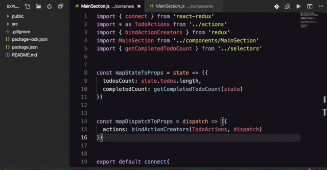

# 

[Visual Studio Code](https://code.visualstudio.com/) Extension for React projects to open the container of the currently open component and viceversa.

## Installation

Download [goto React](https://marketplace.visualstudio.com/items?itemName=rodrigobdz.goto-react) directly from the VSCode Marketplace.

## Usage

1.  Open the Command Palette (⇧+⌘+P)
2.  Type `goto-react`
3.  Run the command `goto-react: Open component/container`.

## Contributing

If you find a bug, please create an [issue](https://github.com/rodrigobdz/goto-react/issues) or a [PR](https://github.com/rodrigobdz/goto-react/pulls).

## Credits

The code used to demonstrate the usage of [goto React](https://github.com/rodrigobdz/goto-react) is an [example](https://github.com/reduxjs/redux/tree/619507a0fa46e6b90c5fca26eaf409c38a078faf/examples/todomvc) taken from the [redux](https://github.com/reduxjs/redux) repo.

## License

[MIT](LICENSE) © [rodrigobdz](https://rodrigobdz.github.io/).
